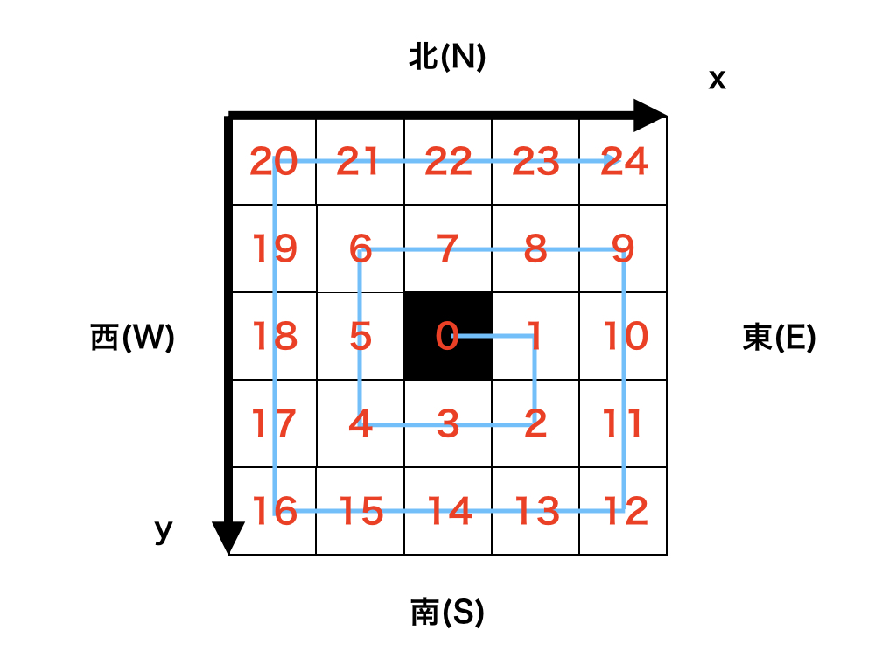

```
開始時点の x , y 座標と移動の歩数 N が与えられます。
以下の図のように時計回りに渦を巻くように移動を N 歩行った後の x , y 座標 を答えてください。

なお、マスの座標系は下方向が y 座標の正の向き、右方向が x 座標の正の向きとします。
```


```
x, y, n = map(int, input().split())
directions = ["E", "S", "W", "N"]
now_direction = 0
count = 0
max_count = 1
first = True


def move(direction, x, y):
    if direction == "N":
        y -= 1
    elif direction == "E":
        x += 1
    elif direction == "S":
        y += 1
    elif direction == "W":
        x -= 1
    return (x, y)


for _ in range(n):
    (x, y) = move(directions[now_direction], x, y)
    count += 1
    if first and count == max_count:
        first = False
        count = 0
        now_direction = (1 + now_direction) % 4
    elif count == max_count:
        first = True
        count = 0
        max_count += 1
        now_direction = (1 + now_direction) % 4


print(x, y)
```
