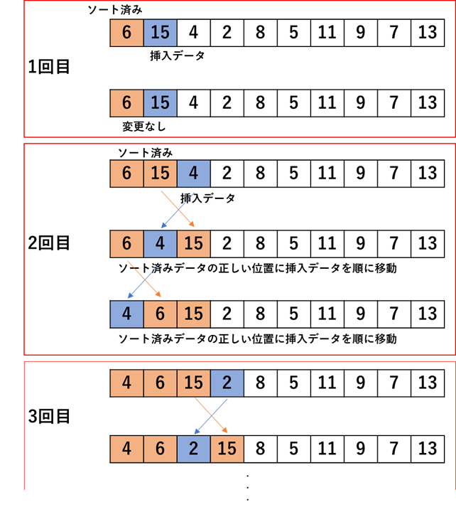

## 挿入ソート

以下の図はイメージ図



```Python
def insert_sort(data):
    """挿入ソート：少しずつソート済み箇所を広げ，昇順に並べ替える"""
    #1つずつ挿入データを吟味する
    for i in range(1, len(data)):
        temporary = data[i]         #挿入データを一時的に記録
        j = i - 1
        while (j >= 0) and (data[j] > temporary):   #挿入データがソート済みデータ内のデータよりも小さく右にあれば繰り返し入れ替え
            data[j + 1] = data[j]       #右へ1つデータを移す
            j -= 1
        data[j + 1] = temporary     #上の操作で移動を終えた所に一時的に記録していた挿入データを代入

    return data
```
>**説明:** 基本的に選択ソートと同様，計算量はオーダー記法で表すと，O(n^2)となり、ただし，一度も交換が発生しない場合は，比較のみ（入れ替えなし）で済むため、O(n)となる
